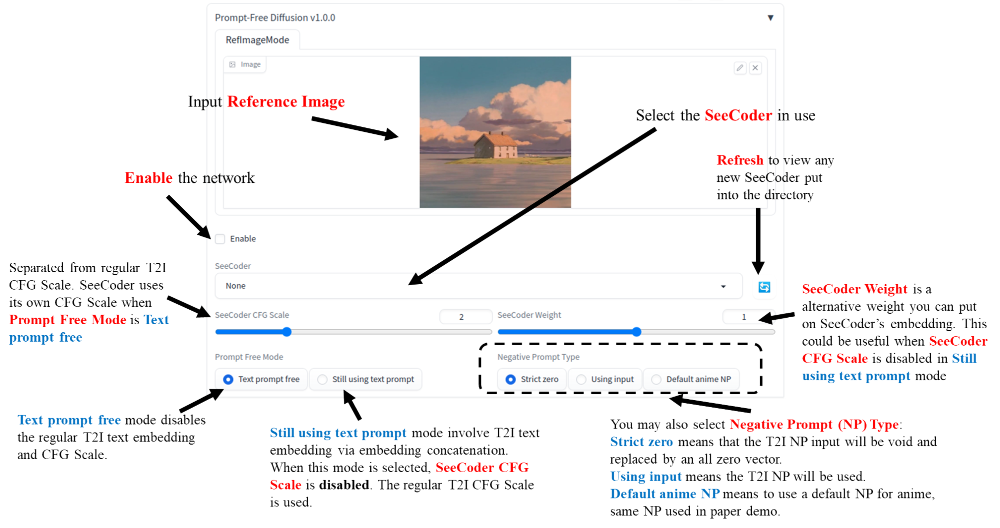

# Prompt-Free Diffusion for Stable Diffusion WebUI

This is the WebUI extension to inject [Prompt-Free Diffusion](https://github.com/SHI-Labs/Prompt-Free-Diffusion) into Stable Diffusion WebUI.

## News

- [2023.06.20]: Repo created

## Instruction

  

This extension is for AUTOMATIC1111's [Stable Diffusion web UI](https://github.com/AUTOMATIC1111/stable-diffusion-webui), allows the Web UI to add [Prompt-Free Diffusion](https://github.com/SHI-Labs/Prompt-Free-Diffusion) to the original Stable Diffusion model to generate images. No training required.

This repo also borrows UI designs and code structures from [SDWebUI ContorlNet](https://github.com/Mikubill/sd-webui-controlnet).

## Installation

1. Open "Extensions" tab.
2. Open "Install from URL" tab in the tab.
3. Enter `https://github.com/xingqian2018/sd-webui-prompt-free-diffusion.git` to "URL for extension's git repository".
4. Press "Install" button.
5. Wait for 5 seconds, and you will see the message "Installed into stable-diffusion-webui\extensions\sd-webui-prompt-free-diffusion. Use Installed tab to restart".
6. Go to "Installed" tab, click "Check for updates", and then click "Apply and restart UI". (The next time you can also use these buttons to update Prompt-Free Diffusion.)
7. Completely restart A1111 webui including your terminal.
8. Download models.
9. After you put models in the correct folder, you may need to refresh to see the models. The refresh button is right to your "SeeCoder" dropdown.

## Download Models

Download the models from Prompt-Free Diffusion mode repo: `https://huggingface.co/shi-labs/prompt-free-diffusion/tree/main/pretrained/pfd/seecoder`. Put it under `extentions/sd-webui-prompt-free-diffusion/models/`. You only need to download SeeCoder. 

